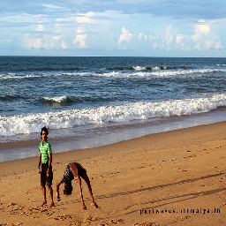
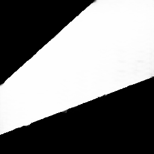
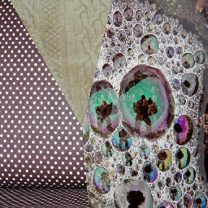
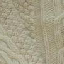
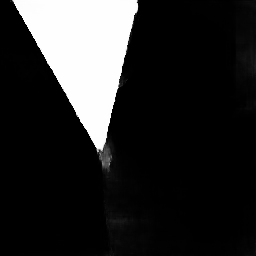
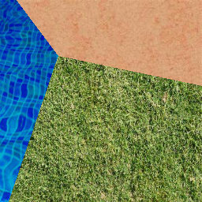
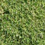

# scene_seg
pytorch implementation of scene_seg

pytorch >= 0.4

based on paper: 
One-shot Texture Segmentation
https://arxiv.org/pdf/1807.02654.pdf

Train the model: 
python train.py
(with args settings)

couple results are given in save_dtd(dtd dataset, http://www.robots.ox.ac.uk/~vgg/data/dtd/),  
                            save_scene (use js script to download training dataset)
                            and in real_test(real test results)

Test the model: 
python test.py
(with args setting)

                        

